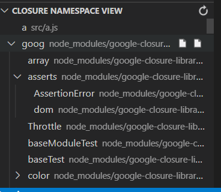

# closure-module-viewer README
Quick find your Closure namespace.  

## Extension Settings
* `base`: Path to Closure library base.js file, must be absolute or relative from the workspace root, defaults to `node_modules/google-closure-library/closure/goog/base.js`.
* `sources`: List of absolute patterns, or relative from the workspace root. You can use the negative patterns(start with !) ignore files or directories, defautls to `["src/**/*.js"]`.  

## Release Notes
### 1.0.0
- Initial release.
